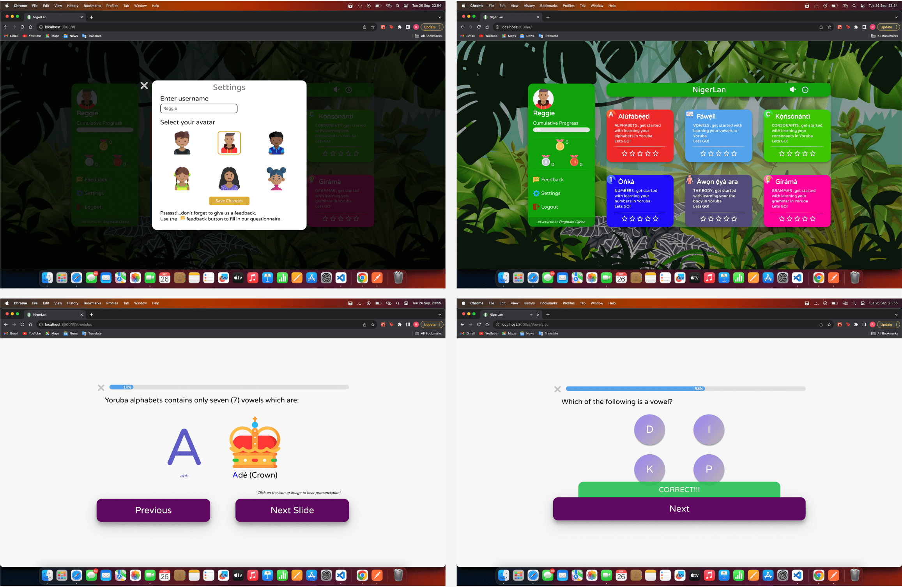
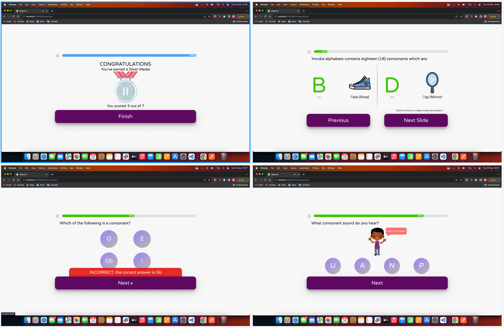
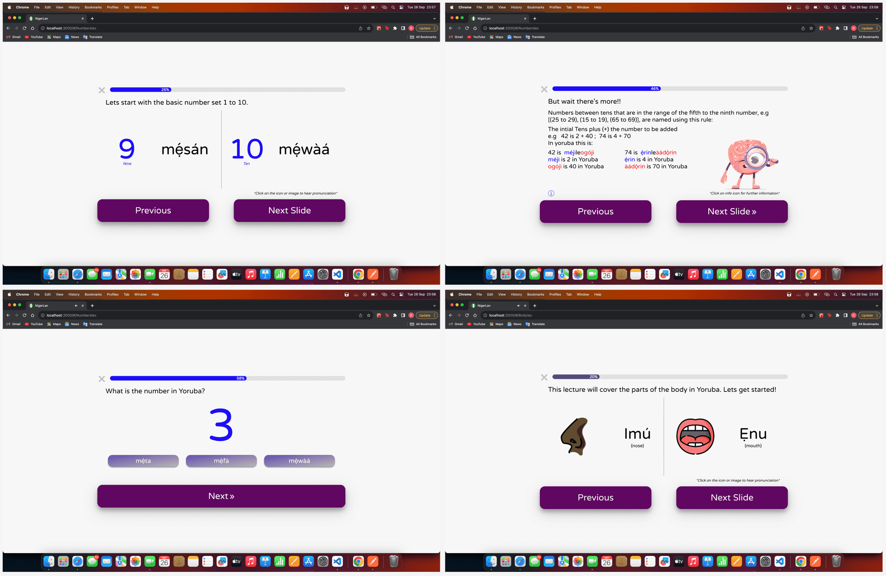
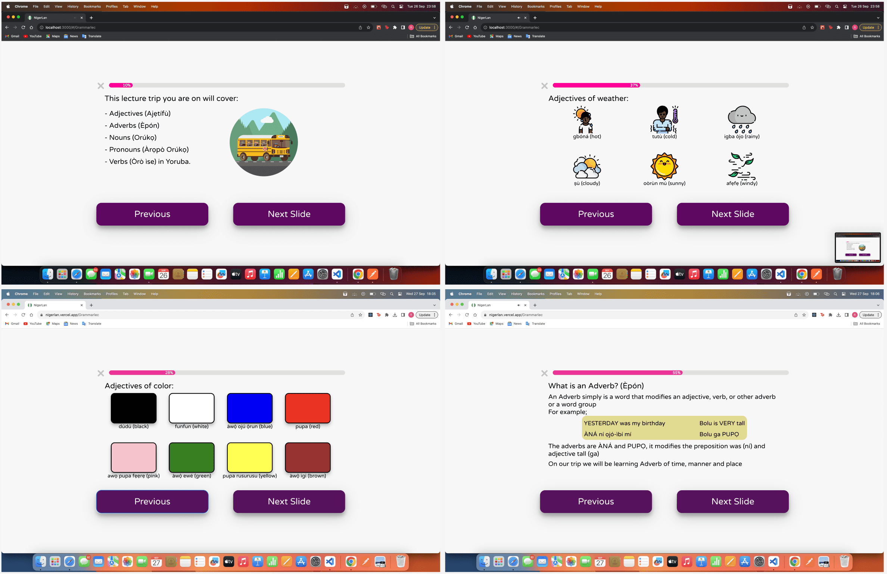

# Welcome to NigerLan - Your Child's Gateway to Learning Yoruba

**NigerLan** is not just another language learning app; it's a virtual adventure designed to make learning Yoruba, an indigenous language of Nigeria, an exhilarating journey for children. With NigerLan, your child will embark on an interactive language learning experience that is both fun and educational. Get ready to unlock the world of Yoruba at [NigerLan App](https://nigerlan.vercel.app).

## 🌟 Key Features

NigerLan is packed with features that will keep your child engaged and excited about learning Yoruba:

1. **Gamified Learning**: Learning Yoruba is an adventure! Our gamified lessons, quizzes, and challenges turn language acquisition into an exciting quest.

2. **Interactive Lessons**: Say goodbye to boring textbooks. Dive into our interactive lessons that cover Yoruba pronunciation, vocabulary, and grammar in an engaging and intuitive way.

3. **Customizable Profiles**: Every child is unique, and so is their learning journey. Create and customize user profiles for each child, tailoring the experience to their specific needs and skill level.

4. **Rich Multimedia**: Learning is more than words; it's about experiences. Access a treasure trove of multimedia content, including audio pronunciations, videos, and images that bring Yoruba to life.

5. **Progress Tracking**: Keep tabs on your child's progress with detailed performance statistics and achievements. Celebrate milestones together and inspire continuous improvement.

## User Interface
NigerLan's user interface is designed with children in mind, making Yoruba language learning not just easy but also a joyous experience. Here's a glimpse of what the app looks like on both mobile and desktop devices:

Settings page | Home page in dark theme \
Vowel Lecture | Quiz game 

Grading system | Consonant Lecture \
Quiz feedback | Quiz variation 

Number Lecture | Number Lecture \
Quiz variation | Body Lecture 

Grammar Lecture | Grammar Lecture \
Grammar Lecture | Grammar Lecture 

## 🚀 Getting Started

To get started with NigerLan, follow these simple steps:

1. Clone this repository to your local machine.
2. Run `npm install` to install all the necessary dependencies.
3. Start the app in development mode using `npm start`. Visit [http://localhost:3000](http://localhost:3000) in your browser to explore NigerLan.

For production deployment, build the app with `npm run build`. It's that easy!

## 🌟 Ongoing Development

***Please note***: NigerLan is a project that's continuously evolving. We are committed to delivering better performance, new user features, a more extensive curriculum, and even more languages for children to explore. Our mission is to provide the best possible learning experience for your child. Stay tuned for exciting updates!

NigerLan is more than just a language learning app; it's an educational adventure waiting to be discovered. Start your child's journey today and watch as they become a Yoruba language champion!